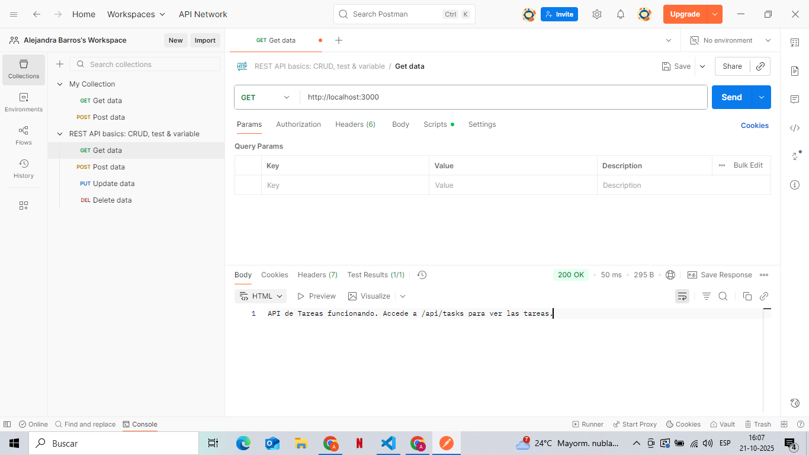
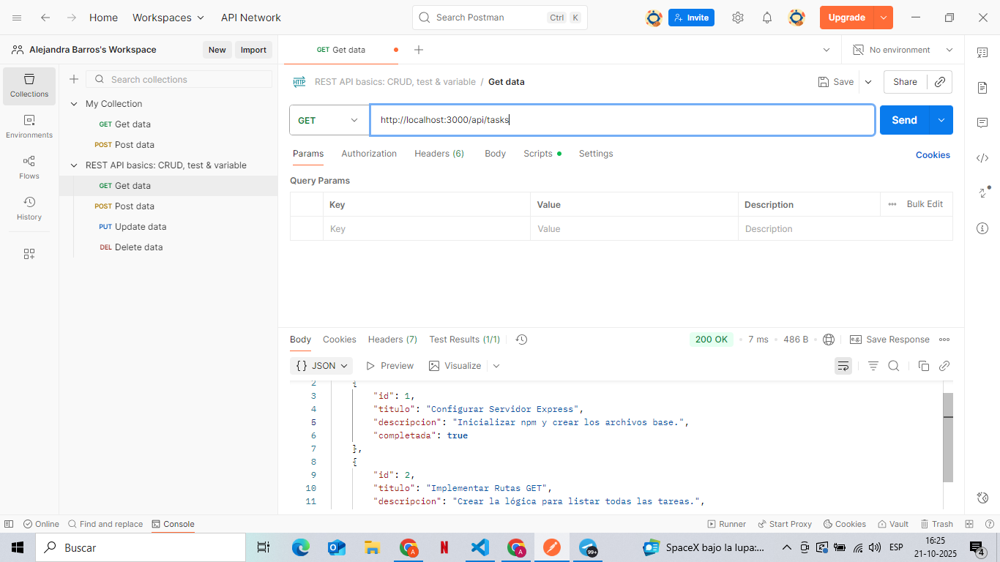

# API RESTful

Esta es una API RESTful construida con Node.js y Express.js que permite realizar operaciones **CRUD** (Crear, Leer, Actualizar y Eliminar) sobre un conjunto de tareas almacenadas en memoria.

## Requisitos Técnicos

* Node.js (versión actualizada)
* npm

## Instalación y Ejecución

1.  **Clonar el repositorio:**
    ```bash
    git clone [URL-DEL-REPOSITORIO]
    cd Api-express
    ```

2.  **Instalar dependencias:**
    ```bash
    npm install express
    ```

3.  **Ejecutar el servidor:**
    ```bash
    node index.js
    ```
    El servidor se iniciará en `http://localhost:3000`.

## Estructura y Componentes

| `index.js` | Servidor principal. Inicializa Express, aplica middlewares y monta las rutas. |
| `routes.js` | Define todos los *endpoints* (`/api/tasks`) y contiene la lógica CRUD, incluyendo validaciones. |
| `data.js` | Almacenamiento en memoria de la lista de tareas. |

## Ejemplos de Pruebas (Usando Postman)

### 1. GET → Listar



### 2. POST → Crear
